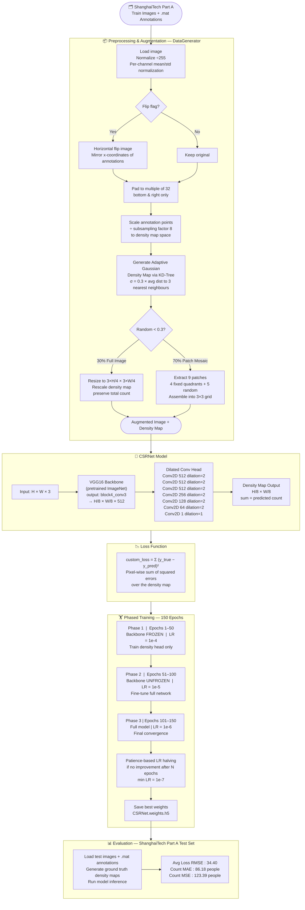
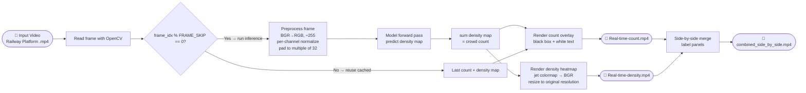

<div align="center">

# 🧠 CSRNet — Real-Time Crowd Counting & Density Estimation

### Deep learning-powered head counting on crowded scenes, trained end-to-end on ShanghaiTech and deployed on real railway platform footage.

[](https://python.org)
[](https://tensorflow.org)
[](https://opencv.org)
[](https://colab.research.google.com)

</div>

---

## What We Built

A full end-to-end crowd counting system based on the **CSRNet** architecture — from raw dataset preprocessing and adaptive density map generation, through 150-epoch phased transfer learning with VGG16, to real-time video inference with live count overlays and jet-colormap density heatmaps.

The model was trained on the **ShanghaiTech Part A** dataset and deployed on real-world **railway platform surveillance footage**, producing a count video, a density heatmap video, and a combined side-by-side demo.

---

## Sample Inference Result

> Predicted density map overlaid on a test image from ShanghaiTech Part A:


---


## Evaluation Results — ShanghaiTech Part A Test Set

| Metric | Value |
|---|---|
| Avg Loss (pixel-level RMSE) | **34.40** |
| Count MAE | **86.18 people** |
| Count MSE | **123.39 people** |
| Dataset | ShanghaiTech Part A |
| Total Epochs | 150 (3 phases × 50) |
| Model Params | 16.26M total (14.5M trainable) |

> MAE and MSE on the held-out test split are the standard benchmarks in crowd counting research — not classification accuracy.

---

## Full Training Pipeline



---

## Video Inference Pipeline



---

## Architecture

| Layer | Output Shape | Params |
|---|---|---|
| Input | (None, None, None, 3) | 0 |
| VGG16 → block4_conv3 | (None, None, None, 512) | 7,635,264 |
| Conv2D 512, 3×3, dilation=2 | (None, None, None, 512) | 2,359,808 |
| Conv2D 512, 3×3, dilation=2 | (None, None, None, 512) | 2,359,808 |
| Conv2D 512, 3×3, dilation=2 | (None, None, None, 512) | 2,359,808 |
| Conv2D 256, 3×3, dilation=2 | (None, None, None, 256) | 1,179,904 |
| Conv2D 128, 3×3, dilation=2 | (None, None, None, 128) | 295,040 |
| Conv2D 64, 3×3, dilation=2 | (None, None, None, 64) | 73,792 |
| Conv2D 1, 1×1, dilation=1 | (None, None, None, 1) | 65 |
| **Total** | | **16,263,489** |

---

## Repository Structure

```
📦 CSRNet-Crowd-Counting
├── 📓 CSRnet-final-trianing-testing-code.ipynb   ← full training + evaluation pipeline
├── 🏋️ CSRNet.weights.h5                          ← trained model weights (16M params)
├── 🖼️  inference_result.png                       ← sample test image inference
├── 📄 CSRnet-Research-paper(Reference).pdf        ← original CSRNet paper
│
├── 📁 video1/                                     ← Railway platform video #1 (7.6s, 60fps, 457 frames)
│   ├── 📓 CSRnet_Inference_on_video(frame-skip-1).ipynb   ← inference every frame
│   ├── 📓 CSRnet_Inference_on_video(frame-skip-5).ipynb   ← inference every 5th frame
│   ├── 🎥 Railway-platform-video.mp4
│   ├── 🎥 Real-time-count(frame-skip-1).mp4
│   ├── 🎥 Real-time-count(frame-skip-5).mp4
│   ├── 🎥 Real-time-density(frame-skip-1).mp4
│   └── 🎥 Real-time-density(frame-skip-5).mp4
│
└── 📁 video2/                                     ← Railway platform video #2 (15.4s, 60fps, 924 frames)
    ├── 📓 CSRnet_Inference_on_video(frame-skip-5).ipynb   ← inference + side-by-side export
    ├── 🎥 Railway-platform-video.mp4
    ├── 🎥 Real-time-count.mp4
    ├── 🎥 Real-time-density.mp4
    └── 🎥 combined_side_by_side(frame-skip-5).mp4         ← ⭐ main demo video
```

---

## Tech Stack

| Library | Usage |
|---|---|
| TensorFlow / Keras | Model definition, custom training loop, GradientTape |
| VGG16 (ImageNet) | Pretrained feature extractor backbone |
| OpenCV | Video I/O, frame preprocessing, rendering |
| SciPy (KDTree) | Adaptive Gaussian kernel computation |
| NumPy | Array ops, density map generation, patch mosaic |
| Matplotlib (cm.jet) | Density heatmap colormap for video output |
| Google Colab (T4 GPU) | Training and inference environment |

---

## How to Run

**1. Setup dataset**
```
Unzip ShanghaiTech dataset and place under Google Drive or local path.
Update train_images, train_maps, test_images, test_maps paths in the notebook.
```

**2. Train the model**
```
Open CSRnet-final-trianing-testing-code.ipynb in Colab
Run all cells — trains for 150 epochs across 3 phases
Best weights auto-saved as CSRNet.weights.h5
```

**3. Run video inference**
```
Open video1/ or video2/ inference notebook
Set VIDEO_PATH to your input video
Set FRAME_SKIP (1 = every frame, 5 = faster)
Outputs: Real-time-count.mp4 + Real-time-density.mp4
```

**4. Generate side-by-side demo**
```
Run the final cell in video2/CSRnet_Inference_on_video(frame-skip-5).ipynb
Outputs combined_side_by_side.mp4 with labeled panels
```

---

## Reference

> Li, Y., Zhang, X., & Chen, D. (2018). **CSRNet: Dilated Convolutional Neural Networks for Understanding the Highly Congested Scenes.** CVPR 2018.
> [https://arxiv.org/abs/1802.10062](https://arxiv.org/abs/1802.10062)
