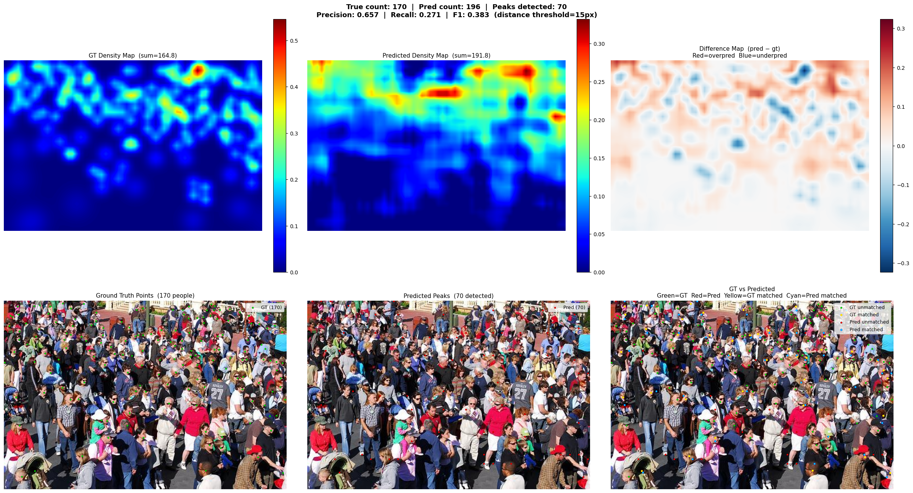

<div align="center">

# 🧠 CSRNet — Real-Time Crowd Counting & Density Estimation

### Deep learning-powered head counting on crowded scenes, trained end-to-end on ShanghaiTech and deployed on real railway platform footage.

[](https://python.org)
[](https://tensorflow.org)
[](https://opencv.org)
[](https://colab.research.google.com)

</div>

---

## What We Built

A full end-to-end crowd counting system based on the **CSRNet** architecture — from raw dataset preprocessing and adaptive density map generation, through phased transfer learning with VGG16, to real-time video inference with live count overlays and jet-colormap density heatmaps.

The model was trained on the **ShanghaiTech Part A** dataset and then deployed on real-world **railway platform surveillance footage**, producing both a count video and a density heatmap video — side by side.

---

## Sample Inference Result

> Predicted density map overlaid on a test image from ShanghaiTech:



---

## Live Demo — Side-by-Side Video Inference

> Left: original video with live head count overlay | Right: predicted density heatmap (jet colormap)

https://github.com/user-attachments/assets/combined_side_by_side

> **Video file:** [`video2/combined_side_by_side(frame-skip-5).mp4`](video2/combined_side_by_side(frame-skip-5).mp4)

---

## Results

| Metric | Value |
|---|---|
| Count MAE | **43.08** |
| Count MSE | **60.77** |
| Dataset | ShanghaiTech Part A |
| Model Params | 16.26M total (14.5M trainable) |

> In crowd counting research, MAE and MSE on the test split are the standard benchmarks — not classification accuracy.

---

## Architecture

```
Input Image (H × W × 3)
        │
        ▼
┌─────────────────────┐
│   VGG16 Backbone    │  ← pretrained on ImageNet, frozen first 10 layers
│  (up to block4_conv3│     output: H/8 × W/8 × 512
└─────────────────────┘
        │
        ▼
┌─────────────────────────────────────────────┐
│         Dilated Convolution Head            │
│  Conv2D(512, 3×3, dilation=2) → ReLU       │
│  Conv2D(512, 3×3, dilation=2) → ReLU       │
│  Conv2D(512, 3×3, dilation=2) → ReLU       │
│  Conv2D(256, 3×3, dilation=2) → ReLU       │
│  Conv2D(128, 3×3, dilation=2) → ReLU       │
│  Conv2D( 64, 3×3, dilation=2) → ReLU       │
│  Conv2D(  1, 1×1, dilation=1) → ReLU       │
└─────────────────────────────────────────────┘
        │
        ▼
  Density Map (H/8 × W/8)
  sum(density_map) ≈ crowd count
```

The dilated convolutions preserve spatial resolution while expanding the receptive field — critical for capturing crowd density at varying scales without losing fine-grained localization.

---

## Key Technical Highlights

### Adaptive Gaussian Density Maps
Ground truth density maps are generated using **KD-tree based adaptive kernels** — for each head annotation, sigma is computed as `0.3 × avg_distance_to_3_nearest_neighbours`. This follows the original CSRNet paper and handles both sparse and dense crowd regions correctly.

### Data Augmentation Pipeline
- Dataset doubled via **horizontal flipping** (flip applied before padding, coordinates mirrored correctly)
- **Patch-mosaic augmentation** (70% of training): 9 random/fixed patches assembled into a 3×3 grid
- **Full-image resize** (30% of training): image resized to canonical patch size, density map rescaled with count preservation
- Per-channel normalization (mean/std) applied to every image

### Phased Training Schedule
| Phase | Backbone | Learning Rate | Purpose |
|---|---|---|---|
| 1 | Frozen | `1e-4` | Train density head only |
| 2 | Unfrozen | `1e-5` | Fine-tune full network |
| 3 | Unfrozen | `1e-6` | Final convergence |

### Video Inference Pipeline
- Frames preprocessed identically to training (normalize → pad to multiple of 32)
- **Frame-skip** configurable (1 = every frame, 5 = every 5th frame for speed)
- Last predicted count and density map cached and reused for skipped frames
- Two output videos generated simultaneously: count overlay + jet heatmap
- A third **side-by-side combined video** merges both with panel labels

---

## Repository Structure

```
📦 CSRNet-Crowd-Counting
├── 📓 CSRnet-final-trianing-testing-code.ipynb   ← full training + evaluation pipeline
├── 🏋️ CSRNet.weights.h5                          ← trained model weights (16M params)
├── 🖼️  inference_result.png                       ← sample test image inference
├── 📄 CSRnet-Research-paper(Reference).pdf        ← original CSRNet paper
│
├── 📁 video1/                                     ← Railway platform video #1 (7.6s, 60fps)
│   ├── 📓 CSRnet_Inference_on_video(frame-skip-1).ipynb   ← inference every frame (457 frames)
│   ├── 📓 CSRnet_Inference_on_video(frame-skip-5).ipynb   ← inference every 5th frame (91 frames)
│   ├── 🎥 Railway-platform-video.mp4
│   ├── 🎥 Real-time-count(frame-skip-1).mp4
│   ├── 🎥 Real-time-count(frame-skip-5).mp4
│   ├── 🎥 Real-time-density(frame-skip-1).mp4
│   └── 🎥 Real-time-density(frame-skip-5).mp4
│
└── 📁 video2/                                     ← Railway platform video #2 (15.4s, 60fps)
    ├── 📓 CSRnet_Inference_on_video(frame-skip-5).ipynb   ← inference + side-by-side export
    ├── 🎥 Railway-platform-video.mp4
    ├── 🎥 Real-time-count.mp4
    ├── 🎥 Real-time-density.mp4
    └── 🎥 combined_side_by_side(frame-skip-5).mp4         ← ⭐ main demo video
```

---

## Tech Stack

| Library | Usage |
|---|---|
| TensorFlow / Keras | Model definition, training, inference |
| VGG16 (ImageNet) | Pretrained feature extractor backbone |
| OpenCV | Video I/O, frame preprocessing, rendering |
| SciPy (KDTree) | Adaptive Gaussian kernel computation |
| NumPy | Array ops, density map generation |
| Matplotlib (cm.jet) | Density heatmap colormap |
| Google Colab (T4 GPU) | Training and inference environment |

---

## How to Run

**1. Setup dataset**
```
Unzip ShanghaiTech dataset and place under Google Drive or local path.
Update train_images, train_maps, test_images, test_maps paths in the notebook.
```

**2. Train the model**
```
Open CSRnet-final-trianing-testing-code.ipynb in Colab
Run all cells — trains for 50 epochs with phased LR schedule
Weights saved as CSRNet.weights.h5
```

**3. Run video inference**
```
Open video1/ or video2/ inference notebook
Set VIDEO_PATH to your input video
Set FRAME_SKIP (1 = accurate, 5 = faster)
Run — outputs count video + density video
```

**4. Generate side-by-side demo**
```
Run the final cell in video2/CSRnet_Inference_on_video(frame-skip-5).ipynb
Outputs combined_side_by_side.mp4 with labeled panels
```

---

## Reference

> Li, Y., Zhang, X., & Chen, D. (2018). **CSRNet: Dilated Convolutional Neural Networks for Understanding the Highly Congested Scenes.** CVPR 2018.
> [https://arxiv.org/abs/1802.10062](https://arxiv.org/abs/1802.10062)
